# AI 招聘与人才发展平台 · 流程图

> 本文档用流程图呈现系统的关键流转。所有图均为 **Mermaid** 语法，GitHub 可直接渲染。
>
> 图与代码一一对应，改动代码时请同步更新本文档 —— 一张与实现不符的流程图，
> 会比没有流程图更容易误导人。

---

## 1 系统全景

五个模块的关系：**能力模型是底座**，三个业务模块并列在上，数据回流横向贯穿。

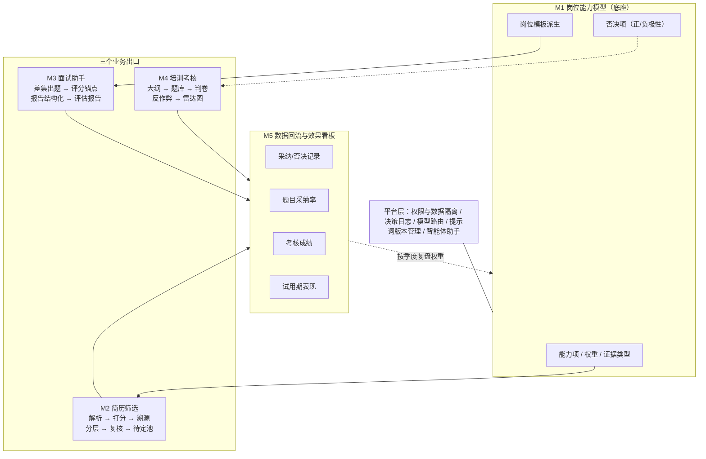
```mermaid
flowchart TB
    subgraph M1["M1 岗位能力模型（底座）"]
        A1["能力项 / 权重 / 证据类型"]
        A2["岗位模板派生"]
        A3["否决项（正/负极性）"]
    end

    subgraph BIZ["三个业务出口"]
        direction LR
        M2["M2 简历筛选<br/>解析 → 打分 → 溯源<br/>分层 → 复核 → 待定池"]
        M3["M3 面试助手<br/>差集出题 → 评分锚点<br/>报告结构化 → 评估报告"]
        M4["M4 培训考核<br/>大纲 → 题库 → 判卷<br/>反作弊 → 雷达图"]
    end

    subgraph M5["M5 数据回流与效果看板"]
        R1["采纳/否决记录"]
        R2["题目采纳率"]
        R3["考核成绩"]
        R4["试用期表现"]
    end

    A1 --> M2
    A2 --> M3
    A3 -.-> M4
    M2 --> M5
    M3 --> M5
    M4 --> M5
    M5 -. "按季度复盘权重" .-> M1

    PL["平台层：权限与数据隔离 / 决策日志 / 模型路由 / 提示词版本管理 / 智能体助手"]
    PL --- M1
```

---

## 2 简历主链路状态机

**状态机是开发与测试对齐的关键，每个状态的进入条件与可执行动作必须唯一。**

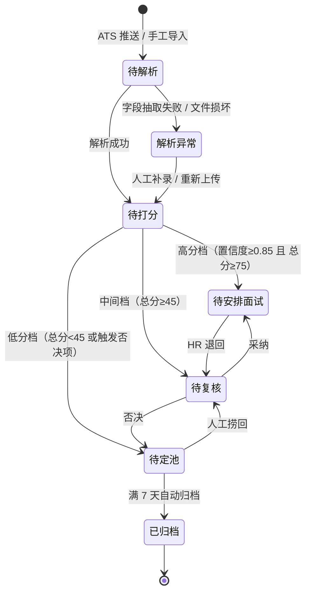
```mermaid
stateDiagram-v2
    [*] --> 待解析: ATS 推送 / 手工导入
    待解析 --> 待打分: 解析成功
    待解析 --> 解析异常: 字段抽取失败 / 文件损坏
    解析异常 --> 待打分: 人工补录 / 重新上传

    待打分 --> 待安排面试: 高分档（置信度≥0.85 且 总分≥75）
    待打分 --> 待复核: 中间档（总分≥45）
    待打分 --> 待定池: 低分档（总分<45 或触发否决项）

    待安排面试 --> 待复核: HR 退回
    待复核 --> 待安排面试: 采纳
    待复核 --> 待定池: 否决

    待定池 --> 待复核: 人工捞回
    待定池 --> 已归档: 满 7 天自动归档

    已归档 --> [*]
```

### 2.1 为什么没有「已拒绝」状态

低分候选人进入**待定池**并在 7 天后**归档**。归档不等于拒绝，也不触发任何对外通知。
是否拒绝、何时告知由 HR 在 ATS 中另行操作。

这是需求分析阶段与法务确认的边界：**平台不承担不利决定的执行**。
系统里根本不存在「拒绝」这个动作，也就不存在误操作导致不可撤回后果的可能。

---

## 3 AI 调用与三级降级

**禁止静默降级**：任何降级都必须在界面明示，否则用户会把兜底结果当作正常结论采信。

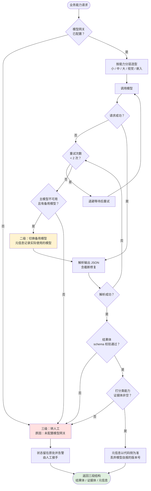
```mermaid
flowchart TD
    START(["业务能力请求"]) --> GATE{"模型网关<br/>已配置？"}
    GATE -- 否 --> HUMAN["三级：转人工<br/>原因：未配置模型网关"]
    GATE -- 是 --> PICK["按能力分层选型<br/>小 / 中 / 大 / 视觉 / 嵌入"]

    PICK --> CALL["调用模型"]
    CALL --> OK{"请求成功？"}
    OK -- 否 --> RETRY{"重试次数<br/>< 2 次？"}
    RETRY -- 是 --> WAIT["退避等待后重试"]
    WAIT --> CALL
    RETRY -- 否 --> SWITCH{"主模型不可用<br/>且有备用模型？"}

    SWITCH -- 是 --> FB["二级：切换备用模型<br/>元信息记录实际使用的模型"]
    FB --> PARSE
    SWITCH -- 否 --> HUMAN

    OK -- 是 --> PARSE["解析输出 JSON<br/>含截断修复"]
    PARSE --> PARSED{"解析成功？"}
    PARSED -- 否 --> RETRY
    PARSED -- 是 --> SCHEMA{"结果体<br/>schema 校验通过？"}

    SCHEMA -- 否 --> HUMAN
    SCHEMA -- 是 --> EVID{"打分类能力<br/>证据体非空？"}
    EVID -- 否 --> HUMAN
    EVID -- 是 --> VERSION["元信息以代码侧为准<br/>丢弃模型自报的版本号"]
    VERSION --> DONE(["返回三段结构<br/>结果体 / 证据体 / 元信息"])

    HUMAN --> HQUEUE["状态留在原处并告警<br/>由人工接手"]
    HQUEUE --> DONE

    style HUMAN fill:#ffe0e0
    style FB fill:#fff3d0
    style DONE fill:#e0f0e0
```

### 3.1 三段结构与硬性校验

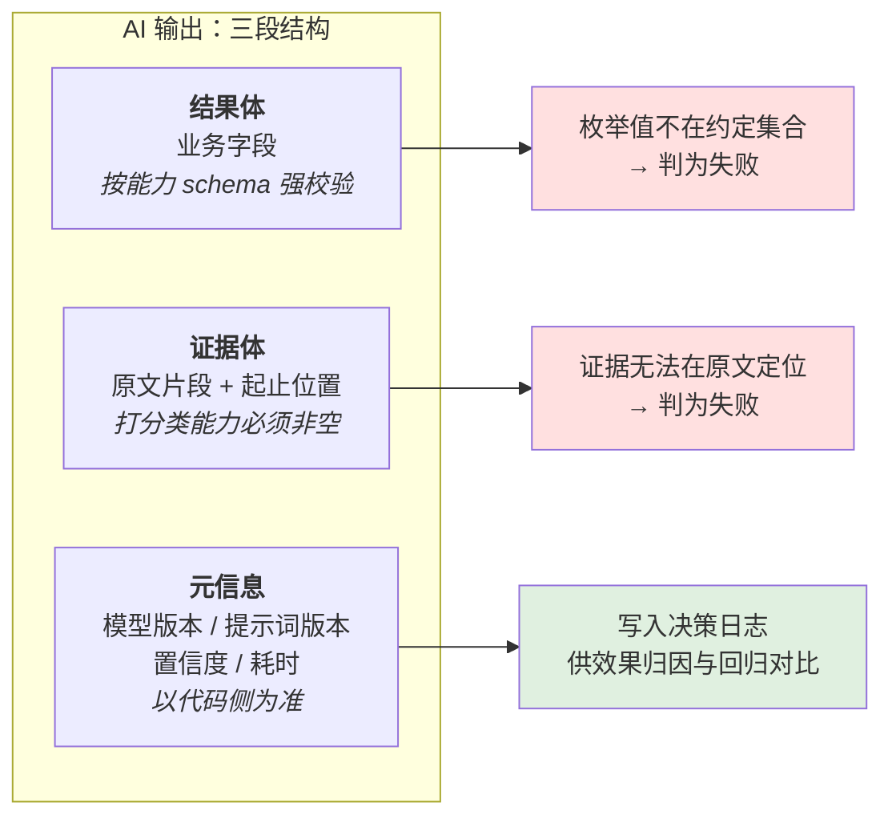
```mermaid
flowchart LR
    subgraph RESULT["AI 输出：三段结构"]
        direction TB
        R1["<b>结果体</b><br/>业务字段<br/><i>按能力 schema 强校验</i>"]
        R2["<b>证据体</b><br/>原文片段 + 起止位置<br/><i>打分类能力必须非空</i>"]
        R3["<b>元信息</b><br/>模型版本 / 提示词版本<br/>置信度 / 耗时<br/><i>以代码侧为准</i>"]
    end

    R2 --> CHECK1["证据无法在原文定位<br/>→ 判为失败"]
    R1 --> CHECK2["枚举值不在约定集合<br/>→ 判为失败"]
    R3 --> CHECK3["写入决策日志<br/>供效果归因与回归对比"]

    style CHECK1 fill:#ffe0e0
    style CHECK2 fill:#ffe0e0
    style CHECK3 fill:#e0f0e0
```

**为什么版本号必须由代码侧写死**：若采信模型自报的版本号，模型可能编造一个不存在的版本，
线上出现效果波动时就无法归因到具体版本，离线回归也就失去了对比基准。

---

## 4 简历筛选：解析与证据溯源

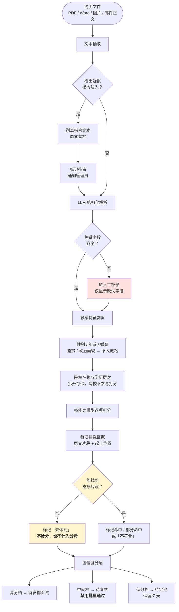
```mermaid
flowchart TD
    FILE(["简历文件<br/>PDF / Word / 图片 / 邮件正文"]) --> EXTRACT["文本抽取"]
    EXTRACT --> INJECT{"检出疑似<br/>指令注入？"}

    INJECT -- 是 --> STRIP["剥离指令文本<br/>原文留档"]
    STRIP --> MARK["标记待审<br/>通知管理员"]
    MARK --> PARSE
    INJECT -- 否 --> PARSE["LLM 结构化解析"]

    PARSE --> FIELDS{"关键字段<br/>齐全？"}
    FIELDS -- 否 --> MANUAL["转人工补录<br/>仅显示缺失字段"]
    FIELDS -- 是 --> SENSITIVE["敏感特征剥离"]

    MANUAL --> SENSITIVE
    SENSITIVE --> S1["性别 / 年龄 / 婚育<br/>籍贯 / 政治面貌 → 不入链路"]
    S1 --> S2["院校名称与学历层次<br/>拆开存储，院校不参与打分"]
    S2 --> SCORE["按能力模型逐项打分"]

    SCORE --> EVIDENCE["每项挂载证据<br/>原文片段 + 起止位置"]
    EVIDENCE --> NOEVID{"能找到<br/>支撑片段？"}
    NOEVID -- 否 --> ABSENT["标记「未体现」<br/><b>不给分，也不计入分母</b>"]
    NOEVID -- 是 --> STATE["标记命中 / 部分命中<br/>或「不符合」"]

    ABSENT --> TIER
    STATE --> TIER["置信度分层"]
    TIER --> T1["高分档 → 待安排面试"]
    TIER --> T2["中间档 → 待复核<br/><b>禁用批量通过</b>"]
    TIER --> T3["低分档 → 待定池<br/>保留 7 天"]

    style NOEVID fill:#fff3d0
    style ABSENT fill:#fff3d0
    style MANUAL fill:#ffe0e0
```

### 4.1 「未体现」与「不符合」必须区分

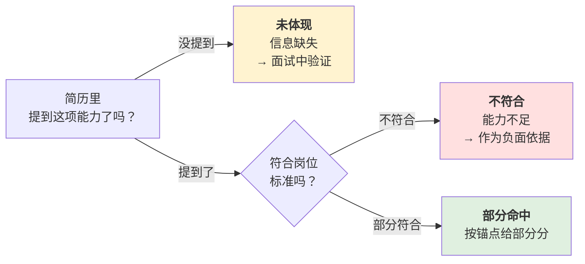
```mermaid
flowchart LR
    Q["简历里<br/>提到这项能力了吗？"] -- "没提到" --> A["<b>未体现</b><br/>信息缺失<br/>→ 面试中验证"]
    Q -- "提到了" --> B{"符合岗位<br/>标准吗？"}
    B -- "不符合" --> C["<b>不符合</b><br/>能力不足<br/>→ 作为负面依据"]
    B -- "部分符合" --> D["<b>部分命中</b><br/>按锚点给部分分"]

    style A fill:#fff3d0
    style C fill:#ffe0e0
    style D fill:#e0f0e0
```

两者混为一谈，会把**表述简略的候选人误判为能力差** —— 这是简历筛选里最常见的不公平来源。

---

## 5 简历复核：人机分工

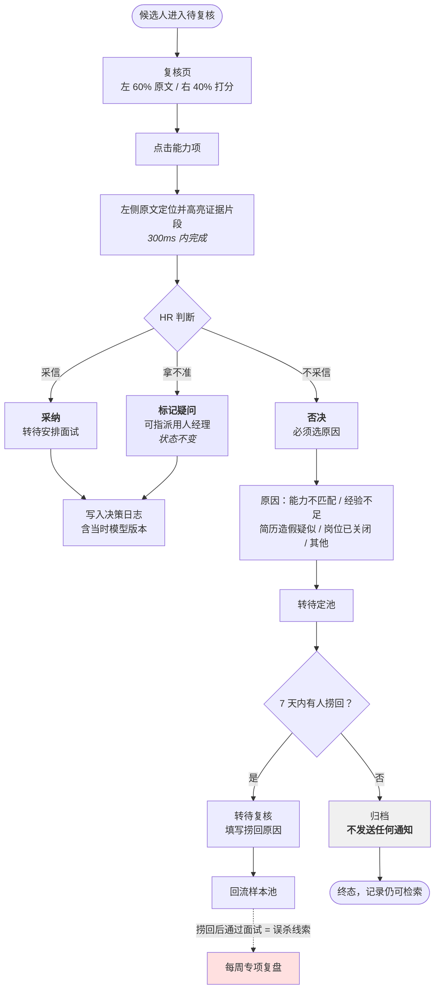
```mermaid
flowchart TD
    IN(["候选人进入待复核"]) --> VIEW["复核页<br/>左 60% 原文 / 右 40% 打分"]
    VIEW --> CLICK["点击能力项"]
    CLICK --> HL["左侧原文定位并高亮证据片段<br/><i>300ms 内完成</i>"]
    HL --> JUDGE{"HR 判断"}

    JUDGE -- "采信" --> ADOPT["<b>采纳</b><br/>转待安排面试"]
    JUDGE -- "不采信" --> REJECT["<b>否决</b><br/>必须选原因"]
    JUDGE -- "拿不准" --> DOUBT["<b>标记疑问</b><br/>可指派用人经理<br/><i>状态不变</i>"]

    ADOPT --> LOG["写入决策日志<br/>含当时模型版本"]
    REJECT --> REASON["原因：能力不匹配 / 经验不足<br/>简历造假疑似 / 岗位已关闭 / 其他"]
    REASON --> POOL["转待定池"]
    DOUBT --> LOG

    POOL --> RESCUE{"7 天内有人捞回？"}
    RESCUE -- "是" --> REBACK["转待复核<br/>填写捞回原因"]
    RESCUE -- "否" --> ARCHIVE["归档<br/><b>不发送任何通知</b>"]
    REBACK --> REFLOW["回流样本池"]
    ARCHIVE --> ENDD(["终态，记录仍可检索"])

    REFLOW -. "捞回后通过面试 = 误杀线索" .-> REVIEW["每周专项复盘"]

    style DOUBT fill:#e8e8ff
    style ARCHIVE fill:#f0f0f0
    style REVIEW fill:#ffe0e0
```

### 5.1 设计要点

| 要点 | 原因 |
| --- | --- |
| 采纳与否决**不设默认选中** | 防止用户无意识批量放行 |
| 中间档**禁用批量通过** | 这部分恰是模型最没把握的样本，有意增加操作成本 |
| 采纳与否决**一键完成**，无需理由即可继续 | 用户最大阻力不是「AI 不准」，而是「AI 不准还要我背责任」 |
| 否决原因**必选**但仅用于优化 | 不用于考核 HR，否则会产生应付式选择 |
| **风险提示只陈述客观事实** | 输出「近三年任职 4 家公司」，不输出「稳定性差」 |

---

## 6 面试题生成：差集出题

**差集出题是本产品的核心设计，且模型会违反它** —— 因此生成后有一道强制约束。

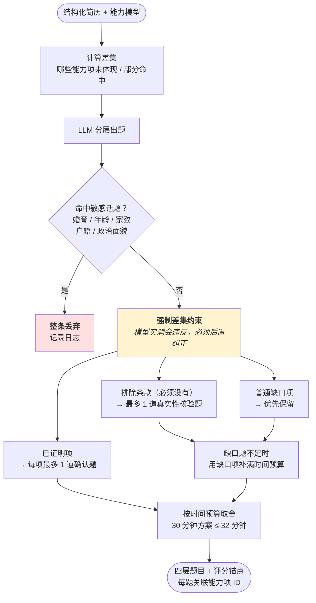
```mermaid
flowchart TD
    IN(["结构化简历 + 能力模型"]) --> DIFF["计算差集<br/>哪些能力项未体现 / 部分命中"]
    DIFF --> GEN["LLM 分层出题"]

    GEN --> BLOCK{"命中敏感话题？<br/>婚育 / 年龄 / 宗教<br/>户籍 / 政治面貌"}
    BLOCK -- 是 --> DROP["<b>整条丢弃</b><br/>记录日志"]
    BLOCK -- 否 --> ENFORCE["<b>强制差集约束</b><br/><i>模型实测会违反，必须后置纠正</i>"]

    ENFORCE --> E1["排除条款（必须没有）<br/>→ 最多 1 道真实性核验题"]
    ENFORCE --> E2["普通缺口项<br/>→ 优先保留"]
    ENFORCE --> E3["已证明项<br/>→ 每项最多 1 道确认题"]

    E1 --> FILL["缺口题不足时<br/>用缺口项补满时间预算"]
    E2 --> FILL
    E3 --> TRIM["按时间预算取舍<br/>30 分钟方案 ≤ 32 分钟"]
    FILL --> TRIM
    TRIM --> OUT(["四层题目 + 评分锚点<br/>每题关联能力项 ID"])

    style DROP fill:#ffe0e0
    style ENFORCE fill:#fff3d0
```

### 6.1 为什么排除条款不能当普通缺口项

排除条款（如「简历真实性存疑」）是给 HR 判断**合规风险**用的，
不是让候选人当面回答「你有没有造假」。实测中模型会把它当普通缺口项猛出题，
出现过 4 道的情况 —— 这在面试现场是不合适的问法。

---

## 7 考核反作弊：三层设计

**只有第一层是真实防线。** 这个区分是整个设计的立足点。

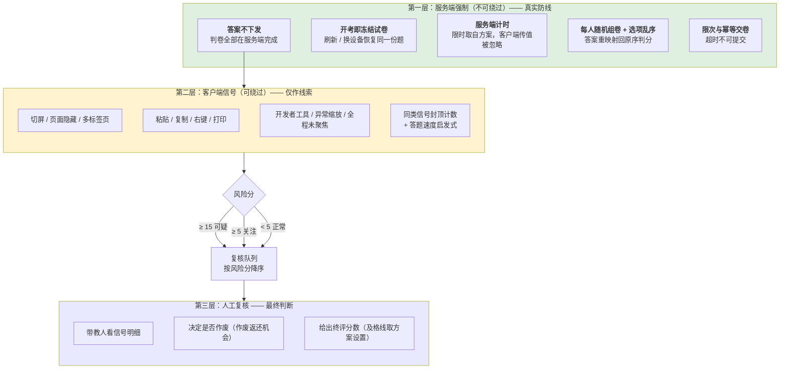
```mermaid
flowchart TB
    subgraph L1["第一层：服务端强制（不可绕过）—— 真实防线"]
        direction TB
        A1["<b>答案不下发</b><br/>判卷全部在服务端完成"]
        A2["<b>开考即冻结试卷</b><br/>刷新 / 换设备恢复同一份题"]
        A3["<b>服务端计时</b><br/>限时取自方案，客户端传值被忽略"]
        A4["<b>每人随机组卷 + 选项乱序</b><br/>答案重映射回原序判分"]
        A5["<b>限次与幂等交卷</b><br/>超时不可提交"]
    end

    subgraph L2["第二层：客户端信号（可绕过）—— 仅作线索"]
        direction TB
        B1["切屏 / 页面隐藏 / 多标签页"]
        B2["粘贴 / 复制 / 右键 / 打印"]
        B3["开发者工具 / 异常缩放 / 全程未聚焦"]
        B4["同类信号封顶计数<br/>+ 答题速度启发式"]
    end

    subgraph L3["第三层：人工复核 —— 最终判断"]
        direction TB
        C1["带教人看信号明细"]
        C2["决定是否作废（作废返还机会）"]
        C3["给出终评分数（及格线取方案设置）"]
    end

    A1 --> L2
    L2 --> RISK{"风险分"}
    RISK -- "≥ 15 可疑" --> QUEUE
    RISK -- "≥ 5 关注" --> QUEUE
    RISK -- "< 5 正常" --> QUEUE["复核队列<br/>按风险分降序"]
    QUEUE --> L3

    style L1 fill:#e0f0e0
    style L2 fill:#fff3d0
    style L3 fill:#e8e8ff
```

### 7.1 为什么第二层不能自动判失败

浏览器事件**技术上不可能防住有心作弊的人**，而且会大量误伤无辜场景：

| 无辜场景 | 会触发的信号 |
| --- | --- |
| 接电话时切出去 | 切屏、页面隐藏 |
| 输入法弹窗 | 失焦 |
| 笔记本合盖 | 页面隐藏、全程未聚焦 |
| 网课页面同时开着 | 多标签页 |

若据此自动判失败，会直接违背需求分析中的洞察二 ——
**误杀的代价远高于漏放**，考核场景同理。

所以三层的关系是：**服务端让作弊拿不到答案，客户端信号把可疑的挑出来给人看，最终由带教人看证据决定。**

### 7.2 考试状态机

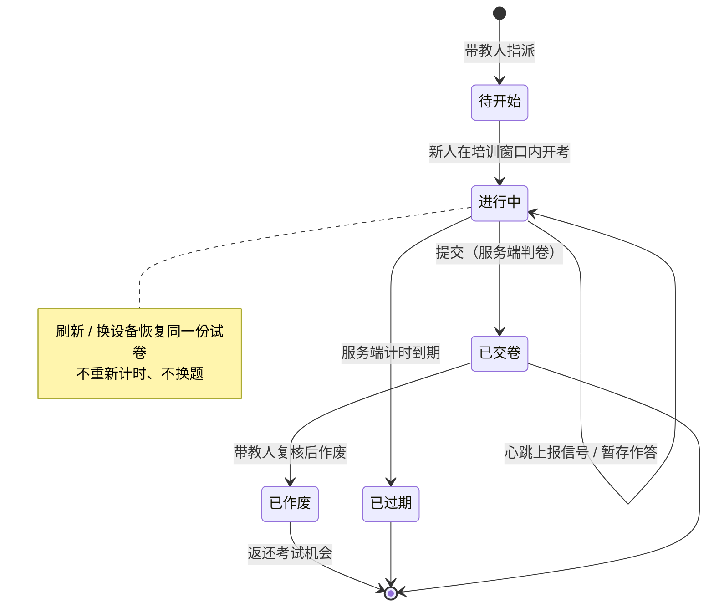
```mermaid
stateDiagram-v2
    [*] --> 待开始: 带教人指派
    待开始 --> 进行中: 新人在培训窗口内开考
    进行中 --> 进行中: 心跳上报信号 / 暂存作答
    进行中 --> 已过期: 服务端计时到期
    进行中 --> 已交卷: 提交（服务端判卷）
    已交卷 --> 已作废: 带教人复核后作废
    已作废 --> [*]: 返还考试机会
    已过期 --> [*]
    已交卷 --> [*]

    note right of 进行中
        刷新 / 换设备恢复同一份试卷
        不重新计时、不换题
    end note
```

### 7.3 选项乱序与答案重映射

这一步是**最容易出错、一旦出错全盘皆错**的地方：题目和选项都被打乱，
若判分时不把学生的答案映射回题库原序，**每一道客观题都会判错**。

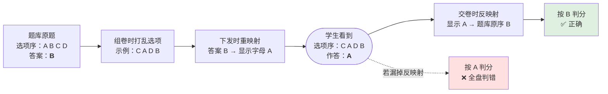
```mermaid
flowchart LR
    BANK["题库原题<br/>选项序：A B C D<br/>答案：<b>B</b>"] --> SHUF["组卷时打乱选项<br/>示例：C A D B"]
    SHUF --> SHOW["下发时重映射<br/>答案 B → 显示字母 A"]
    SHOW --> STU(["学生看到<br/>选项序：C A D B<br/>作答：<b>A</b>"])
    STU --> UNMAP["交卷时反映射<br/>显示 A → 题库原序 B"]
    UNMAP --> GRADE["按 B 判分<br/>✅ 正确"]
    STU -. "若漏掉反映射" .-> WRONG["按 A 判分<br/>❌ 全盘判错"]

    style GRADE fill:#e0f0e0
    style WRONG fill:#ffe0e0
```

---

## 8 资料驱动的内容生成

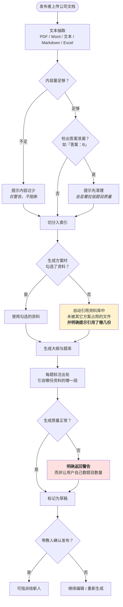
```mermaid
flowchart TD
    UP(["发布者上传公司文档"]) --> EXTRACT["文本抽取<br/>PDF / Word / 文本 / Markdown / Excel"]
    EXTRACT --> SIZE{"内容量足够？"}
    SIZE -- "不足" --> WARN1["提示内容过少<br/><i>仅警告，不阻断</i>"]
    SIZE -- "足够" --> QUALITY{"检出答案泄漏？<br/>如「答案：B」"}
    WARN1 --> CHUNK
    QUALITY -- "是" --> WARN2["提示先清理<br/><i>会显著拉低题目质量</i>"]
    QUALITY -- "否" --> CHUNK["切分入索引"]

    WARN2 --> CHUNK
    CHUNK --> BIND{"生成方案时<br/>勾选了资料？"}

    BIND -- "是" --> USE["使用勾选的资料"]
    BIND -- "否" --> FALLBACK["自动引用资料库中<br/>未被其它方案占用的文件<br/><b>并明确提示引用了哪几份</b>"]
    USE --> GEN
    FALLBACK --> GEN["生成大纲与题库"]

    GEN --> REF["每题标注出处<br/>引自哪份资料的哪一段"]
    REF --> INFO{"生成质量正常？"}
    INFO -- "否" --> WARN3["<b>明确返回警告</b><br/>而非让用户自己数题目数量"]
    INFO -- "是" --> DRAFT
    WARN3 --> DRAFT["标记为草稿"]
    DRAFT --> PUBLISH{"带教人确认发布？"}
    PUBLISH -- "是" --> ASSIGN["可指派给新人"]
    PUBLISH -- "否" --> EDIT["继续编辑 / 重新生成"]

    style WARN3 fill:#ffe0e0
    style FALLBACK fill:#fff3d0
```

---

## 9 数据回流闭环

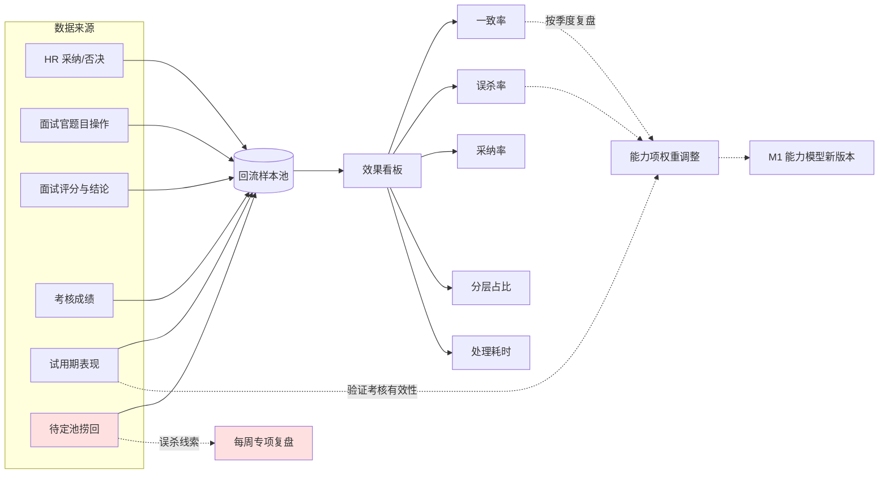
```mermaid
flowchart LR
    subgraph SRC["数据来源"]
        A["HR 采纳/否决"]
        B["面试官题目操作"]
        C["面试评分与结论"]
        D["考核成绩"]
        E["试用期表现"]
        F["待定池捞回"]
    end

    A --> POOL[("回流样本池")]
    B --> POOL
    C --> POOL
    D --> POOL
    E --> POOL
    F --> POOL

    POOL --> BOARD["效果看板"]
    BOARD --> M1["一致率"]
    BOARD --> M2["误杀率"]
    BOARD --> M3["采纳率"]
    BOARD --> M4["分层占比"]
    BOARD --> M5["处理耗时"]

    M1 -. "按季度复盘" .-> REV["能力项权重调整"]
    M2 -.-> REV
    E -. "验证考核有效性" .-> REV
    REV -.-> MODEL["M1 能力模型新版本"]
    F -. "误杀线索" .-> WEEKLY["每周专项复盘"]

    style F fill:#ffe0e0
    style WEEKLY fill:#ffe0e0
```

### 9.1 捞回记录为什么是最有价值的回流

**捞回后通过面试的案例，就是一次「差点被误杀」的实证。**
这条链路是发现误杀模式最直接的入口，因此单独列表、每周由 HR 负责人复盘，
而不是混在总体指标里被平均掉。

---

## 10 权限与数据隔离

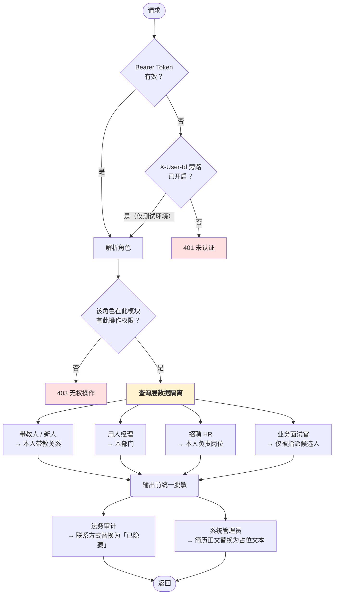
```mermaid
flowchart TD
    REQ(["请求"]) --> AUTH{"Bearer Token<br/>有效？"}
    AUTH -- 否 --> HDR{"X-User-Id 旁路<br/>已开启？"}
    HDR -- "是（仅测试环境）" --> ROLE
    HDR -- "否" --> E401["401 未认证"]
    AUTH -- 是 --> ROLE["解析角色"]

    ROLE --> PERM{"该角色在此模块<br/>有此操作权限？"}
    PERM -- 否 --> E403["403 无权操作"]
    PERM -- 是 --> SCOPE["<b>查询层数据隔离</b>"]

    SCOPE --> S1["业务面试官<br/>→ 仅被指派候选人"]
    SCOPE --> S2["招聘 HR<br/>→ 本人负责岗位"]
    SCOPE --> S3["用人经理<br/>→ 本部门"]
    SCOPE --> S4["带教人 / 新人<br/>→ 本人带教关系"]

    S1 --> MASK
    S2 --> MASK
    S3 --> MASK
    S4 --> MASK
    MASK["输出前统一脱敏"] --> M1["系统管理员<br/>→ 简历正文替换为占位文本"]
    MASK --> M2["法务审计<br/>→ 联系方式替换为「已隐藏」"]
    M1 --> OUT(["返回"])
    M2 --> OUT

    style E401 fill:#ffe0e0
    style E403 fill:#ffe0e0
    style SCOPE fill:#fff3d0
```

### 10.1 两条合规硬约束

| 约束 | 原因 |
| --- | --- |
| **面试官只能看到被指派的候选人** | 避免简历在组织内无边界流动 |
| **系统管理员不可查看简历正文** | 防止运维角色成为数据合规的缺口 |

两条均实现为**查询层过滤**，而非前端隐藏 ——
前端隐藏只能防误操作，防不住有心越权。
即便是超级管理员，「不可查看简历正文」这条限制同样生效。

---

## 11 登录与角色差异

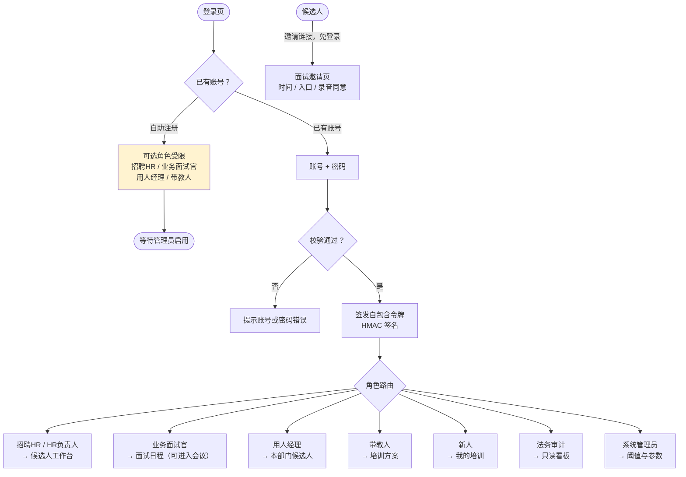
```mermaid
flowchart TD
    LOGIN(["登录页"]) --> TYPE{"已有账号？"}
    TYPE -- "自助注册" --> SIGNUP["可选角色受限<br/>招聘HR / 业务面试官<br/>用人经理 / 带教人"]
    TYPE -- "已有账号" --> CRED["账号 + 密码"]

    SIGNUP --> WAIT(["等待管理员启用"])
    CRED --> VERIFY{"校验通过？"}
    VERIFY -- 否 --> FAIL["提示账号或密码错误"]
    VERIFY -- 是 --> TOKEN["签发自包含令牌<br/>HMAC 签名"]

    TOKEN --> ROUTE{"角色路由"}
    ROUTE --> R1["招聘HR / HR负责人<br/>→ 候选人工作台"]
    ROUTE --> R2["业务面试官<br/>→ 面试日程（可进入会议）"]
    ROUTE --> R3["用人经理<br/>→ 本部门候选人"]
    ROUTE --> R4["带教人<br/>→ 培训方案"]
    ROUTE --> R5["新人<br/>→ 我的培训"]
    ROUTE --> R6["法务审计<br/>→ 只读看板"]
    ROUTE --> R7["系统管理员<br/>→ 阈值与参数"]

    INV(["候选人"]) -- "邀请链接，免登录" --> R8["面试邀请页<br/>时间 / 入口 / 录音同意"]
    style R8 fill:#e8e8ff

    style SIGNUP fill:#fff3d0
```

**为什么自助注册只开放 4 种角色**：若开放高权限角色，
任何人都能给自己开一个看全量数据的账号，权限矩阵形同虚设。
系统管理员、HR 负责人、法务审计必须由管理员创建。

---

## 12 面试安排与指派面试官

**面试官必须显式选择。** 此前缺省会静默挂到第一个面试官名下，所有面试都堆给了同一个人。

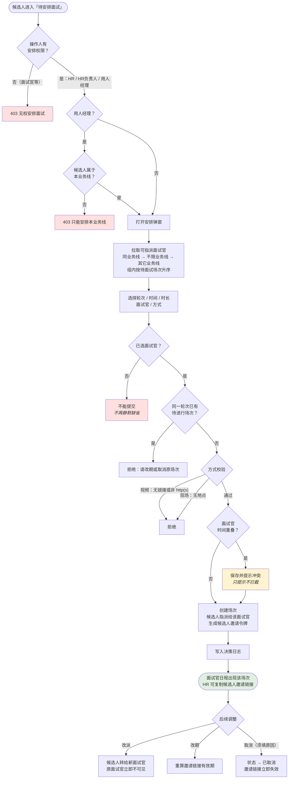
```mermaid
flowchart TD
    START(["候选人进入「待安排面试」"]) --> WHO{"操作人有<br/>安排权限？"}
    WHO -- "否（面试官等）" --> E403["403 无权安排面试"]
    WHO -- "是：HR / HR负责人 / 用人经理" --> SCOPE{"用人经理？"}
    SCOPE -- "是" --> SAME{"候选人属于<br/>本业务线？"}
    SAME -- "否" --> E403B["403 只能安排本业务线"]
    SAME -- "是" --> FORM
    SCOPE -- "否" --> FORM["打开安排弹窗"]

    FORM --> LIST["拉取可指派面试官<br/>同业务线 → 不限业务线 → 其它业务线<br/>组内按待面试场次升序"]
    LIST --> FILL["选择轮次 / 时间 / 时长<br/>面试官 / 方式"]
    FILL --> V1{"已选面试官？"}
    V1 -- "否" --> ERR1["不能提交<br/><i>不再静默缺省</i>"]
    V1 -- "是" --> V2{"同一轮次已有<br/>待进行场次？"}
    V2 -- "是" --> ERR2["拒绝：请改期或取消原场次"]
    V2 -- "否" --> V3{"方式校验"}
    V3 -- "视频：无链接或非 http(s)" --> ERR3["拒绝"]
    V3 -- "现场：无地点" --> ERR3
    V3 -- "通过" --> CONFLICT{"面试官<br/>时间重叠？"}
    CONFLICT -- "是" --> WARN["保存并提示冲突<br/><i>只提示不拦截</i>"]
    CONFLICT -- "否" --> SAVE
    WARN --> SAVE["创建场次<br/>候选人指派给该面试官<br/>生成候选人邀请令牌"]
    SAVE --> LOG["写入决策日志"]
    LOG --> DONE(["面试官日程出现该场次<br/>HR 可复制候选人邀请链接"])

    DONE --> CHG{"后续调整"}
    CHG -- "改派" --> RE["候选人转给新面试官<br/>原面试官立即不可见"]
    CHG -- "改期" --> RT["重算邀请链接有效期"]
    CHG -- "取消（须填原因）" --> CX["状态 → 已取消<br/>邀请链接立即失效"]

    style ERR1 fill:#ffe0e0
    style E403 fill:#ffe0e0
    style E403B fill:#ffe0e0
    style WARN fill:#fff3d0
    style DONE fill:#e0f0e0
```

### 12.1 面试日程状态机

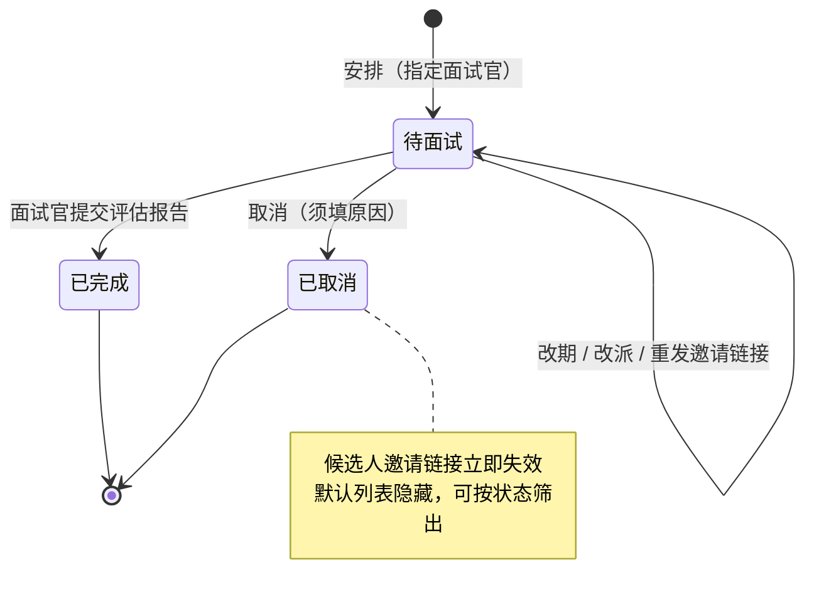
```mermaid
stateDiagram-v2
    [*] --> 待面试: 安排（指定面试官）
    待面试 --> 待面试: 改期 / 改派 / 重发邀请链接
    待面试 --> 已完成: 面试官提交评估报告
    待面试 --> 已取消: 取消（须填原因）
    已完成 --> [*]
    已取消 --> [*]

    note right of 已取消
        候选人邀请链接立即失效
        默认列表隐藏，可按状态筛出
    end note
```

---

## 13 视频面试：两类人怎么进

**平台不自建音视频**，接入公司已有会议工具。平台负责把入口、时间与身份送到对的人手里。

| | 面试官 | 候选人 |
| --- | --- | --- |
| 身份 | 平台账号（与日常登录相同） | **无需账号**，一次性邀请链接 |
| 看到什么 | 会议入口 + 分层题目 + 评分锚点 | 仅本场时间、方式、入口 |
| 录音同意 | 查看候选人的选择 | 在链接页表态，开始前可改 |

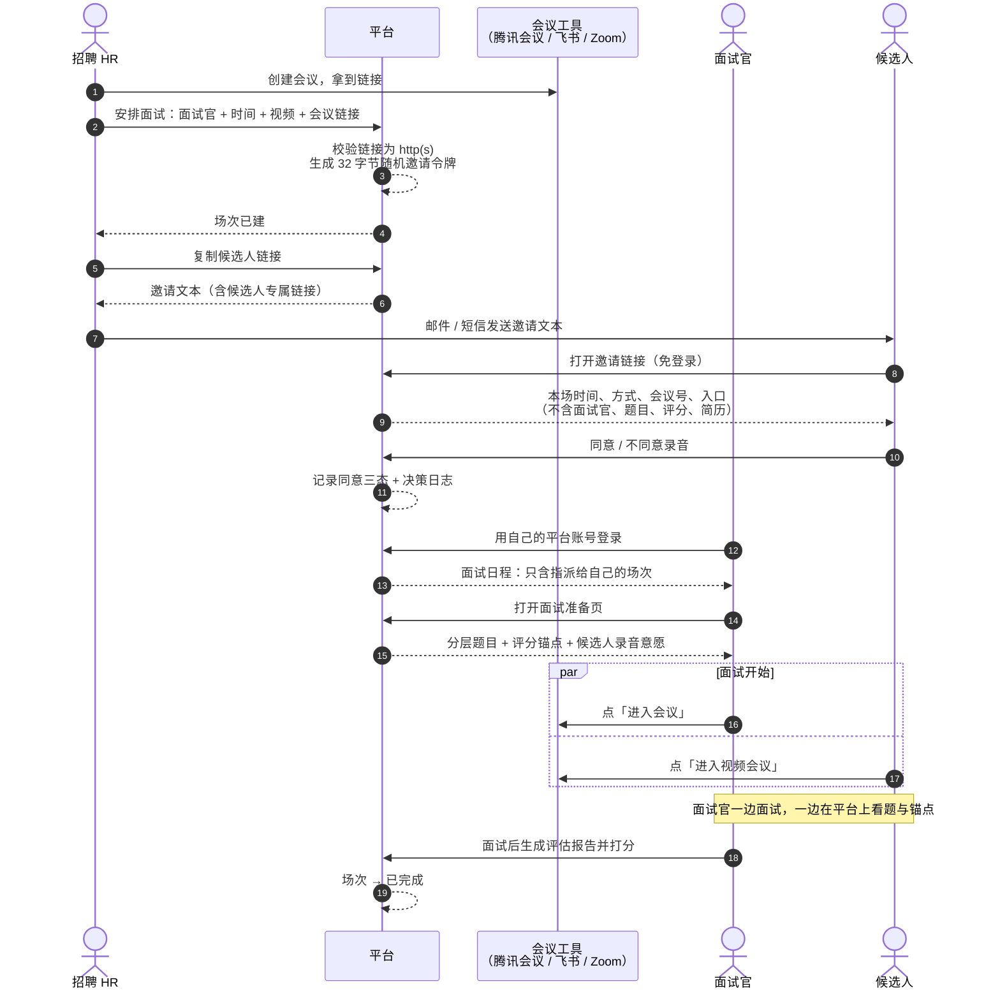
```mermaid
sequenceDiagram
    autonumber
    actor HR as 招聘 HR
    participant P as 平台
    participant M as 会议工具<br/>（腾讯会议 / 飞书 / Zoom）
    actor I as 面试官
    actor C as 候选人

    HR->>M: 创建会议，拿到链接
    HR->>P: 安排面试：面试官 + 时间 + 视频 + 会议链接
    P-->>P: 校验链接为 http(s)<br/>生成 32 字节随机邀请令牌
    P-->>HR: 场次已建
    HR->>P: 复制候选人链接
    P-->>HR: 邀请文本（含候选人专属链接）
    HR->>C: 邮件 / 短信发送邀请文本

    C->>P: 打开邀请链接（免登录）
    P-->>C: 本场时间、方式、会议号、入口<br/>（不含面试官、题目、评分、简历）
    C->>P: 同意 / 不同意录音
    P-->>P: 记录同意三态 + 决策日志

    I->>P: 用自己的平台账号登录
    P-->>I: 面试日程：只含指派给自己的场次
    I->>P: 打开面试准备页
    P-->>I: 分层题目 + 评分锚点 + 候选人录音意愿

    par 面试开始
        I->>M: 点「进入会议」
    and
        C->>M: 点「进入视频会议」
    end

    Note over I,C: 面试官一边面试，一边在平台上看题与锚点

    I->>P: 面试后生成评估报告并打分
    P-->>P: 场次 → 已完成
```

### 13.1 候选人邀请链接的有效性

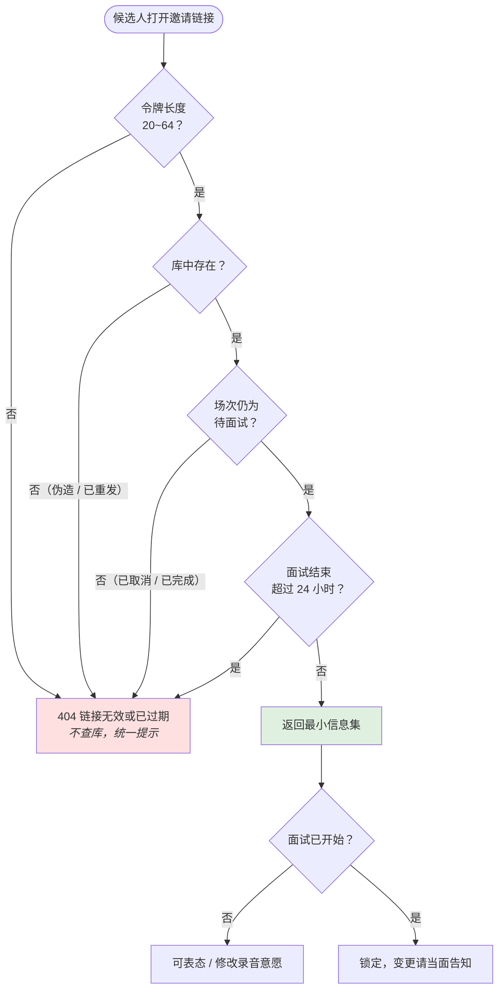
```mermaid
flowchart TD
    OPEN(["候选人打开邀请链接"]) --> LEN{"令牌长度<br/>20~64？"}
    LEN -- "否" --> NF["404 链接无效或已过期<br/><i>不查库，统一提示</i>"]
    LEN -- "是" --> FIND{"库中存在？"}
    FIND -- "否（伪造 / 已重发）" --> NF
    FIND -- "是" --> ST{"场次仍为<br/>待面试？"}
    ST -- "否（已取消 / 已完成）" --> NF
    ST -- "是" --> EXP{"面试结束<br/>超过 24 小时？"}
    EXP -- "是" --> NF
    EXP -- "否" --> SHOW["返回最小信息集"]

    SHOW --> CON{"面试已开始？"}
    CON -- "否" --> EDIT["可表态 / 修改录音意愿"]
    CON -- "是" --> LOCK["锁定，变更请当面告知"]

    style NF fill:#ffe0e0
    style SHOW fill:#e0f0e0
```

**无效、过期、取消统一返回同一个 404**：若分别提示「已取消」「已过期」，
外部人员就能据此判断某个令牌曾经存在过。

### 13.2 面试官准备页的录音提示

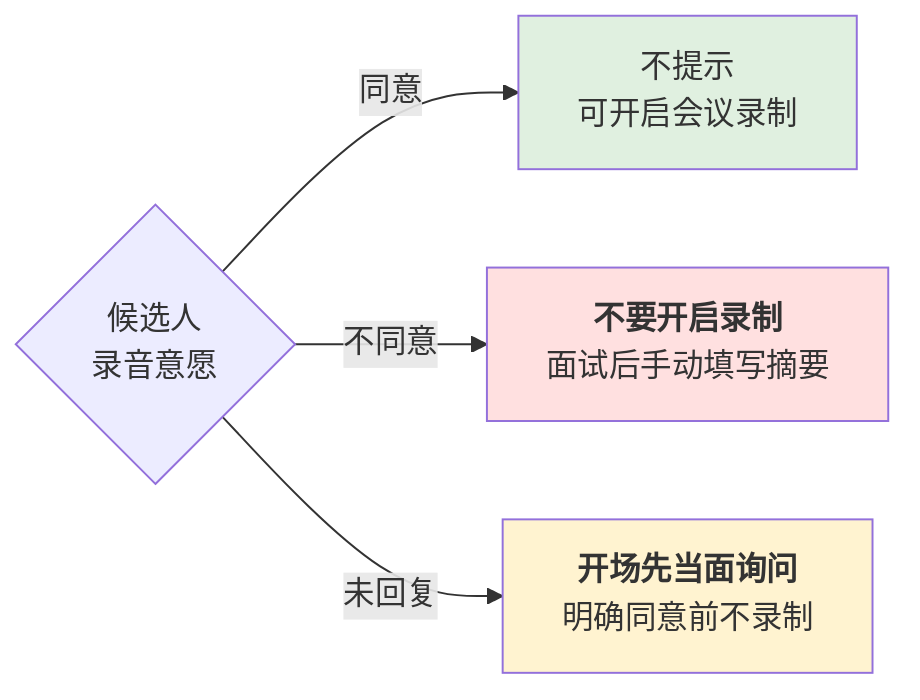
```mermaid
flowchart LR
    S{"候选人<br/>录音意愿"} -- "同意" --> A["不提示<br/>可开启会议录制"]
    S -- "不同意" --> B["<b>不要开启录制</b><br/>面试后手动填写摘要"]
    S -- "未回复" --> C["<b>开场先当面询问</b><br/>明确同意前不录制"]

    style A fill:#e0f0e0
    style B fill:#ffe0e0
    style C fill:#fff3d0
```

「不同意」与「未回复」必须分开：前者直接走手动摘要，后者还要当面再问一次。
只用一个布尔值记录，两种情况会被混成「没同意」，面试官无法区分该怎么做。

---

## 14 业务线字典

业务线是**数据隔离的边界**，所以必须是受控字典。账号、岗位、知识库只能从这里选。

```mermaid
flowchart TD
    subgraph USE["业务线被谁引用"]
        U1["账号<br/>决定用人经理能看哪些候选人"]
        U2["岗位<br/>决定候选人属于哪条业务线"]
        U3["知识库文档<br/>决定检索范围"]
    end

    DICT[("业务线字典")] --> U1
    DICT --> U2
    DICT --> U3

    ADD["新增"] --> DICT
    REN["改名"] --> TX["同一事务内级联更新<br/>账号 + 岗位 + 知识库"]
    TX --> DICT
    OFF["停用"] --> KEEP["不能再被新选择<br/>已有数据不变"]
    KEEP --> DICT

    DEL["删除"] --> INUSE{"仍被引用？"}
    INUSE -- "否" --> RM["直接删除"]
    INUSE -- "是" --> MIG{"指定了<br/>迁移目标？"}
    MIG -- "否" --> BLOCK["拒绝删除<br/>提示迁移或改用停用"]
    MIG -- "是" --> MOVE["引用迁移到目标业务线"]
    MOVE --> RM

    style BLOCK fill:#ffe0e0
    style TX fill:#fff3d0
```

### 14.1 为什么不能让业务线是自由文本

```mermaid
flowchart LR
    A["账号：用人经理<br/>业务线 = 「电商业务线」"] --> Q{"候选人列表<br/>按业务线过滤"}
    B["岗位：后端开发<br/>业务线 = 「电商线」"] --> Q
    Q --> R["字符串不相等<br/>→ 一个候选人都看不到<br/><b>且没有任何报错</b>"]

    style R fill:#ffe0e0
```

隔离失效最危险的形态不是报错，而是**静默地少看到数据**。受控字典让这种不一致无法被录入。

## 相关文档

- [需求分析文档](需求分析文档.md) —— 问题定义、目标、场景选型、合规红线
- [产品需求文档 PRD](PRD.md) —— 页面、字段、规则、异常、验收标准
- [使用指南](使用指南.md) —— 面向使用者的操作说明
